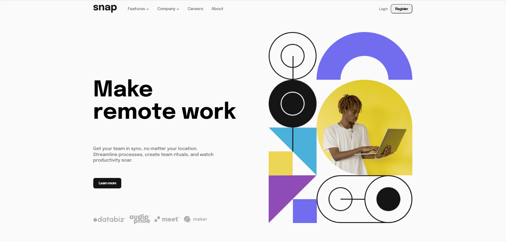

# Frontend Mentor - Intro section with dropdown navigation

This is a solution to the [Intro section with dropdown navigation](https://www.frontendmentor.io/challenges/intro-section-with-dropdown-navigation-ryaPetHE5). Frontend Mentor challenges help you improve your coding skills by building realistic projects.

## Table of contents

- [Overview](#overview)
  - [The challenge](#the-challenge)
  - [Screenshot](#screenshot)
  - [Links](#links)
  - [Installation](#Installation)
- [My process](#my-process)
  - [Built with](#built-with)
  - [What I learned](#what-i-learned)
  - [Continued development](#continued-development)
- [Author](#author)
- [Acknowledgments](#Acknowledgments)

## Overview

### The challenge

This challenge will test your ability to create dropdown navigation menus, a common pattern on larger sites. It will also provide some nice basic layout challenges.

Your users should be able to:

- View the relevant dropdown menus on desktop and mobile when interacting with the navigation links
- View the optimal layout for the content depending on their device's screen size
- See hover states for all interactive elements on the page

### Screenshot



### Links

- Solution URL: [here](https://github.com/olahasan/HTML_CSS_AND_J.S_frontend-mentor_JUNIOR_intro-section-with-dropdown-navigation-main)

- Live Site URL: [here](https://olahasan.github.io/HTML_CSS_AND_J.S_frontend-mentor_JUNIOR_intro-section-with-dropdown-navigation-main/)

## Installation

To get a local copy up and running, follow these simple steps:

1. **Clone the repository**:

   ```sh
   git clone https://github.com/your-username/your-repo-name.git
   ```

2. **Navigate to the project directory**:

   ```sh
   cd your-repo-name
   ```

3. **Open the project in your preferred code editor**.

## My process

### Built with

- Responsive design
- Dropdown navigation menu
- Smooth transitions and animations
- Lazy loading for images
- Accessible and semantic HTML

### What I Learned

Through this project, I gained a deeper understanding of:

- **Responsive Design**: Implementing media queries to ensure the layout adapts to different screen sizes.
- **CSS Flexbox**: Using flexbox for layout and alignment.
- **JavaScript Event Handling**: Managing click events and toggling classes to show/hide elements.
- **Performance Optimization**: Using lazy loading for images to improve page load times.

### Continued Development

Future improvements and features I plan to add include:

- **Accessibility Enhancements**: Adding ARIA attributes to improve accessibility for screen readers.
- **Additional Animations**: Implementing more animations for a smoother user experience.
- **Code Refactoring**: Continuously reviewing and refactoring the code to improve readability and maintainability.
- **Testing**: Adding unit tests to ensure the functionality works as expected.

### Author

Frontend Mentor - @olahasan<br>
GitHub - @olahasan

### Acknowledgments

I would like to thank the **Frontend Mentor** for providing this challenge and to the community for their support and feedback
